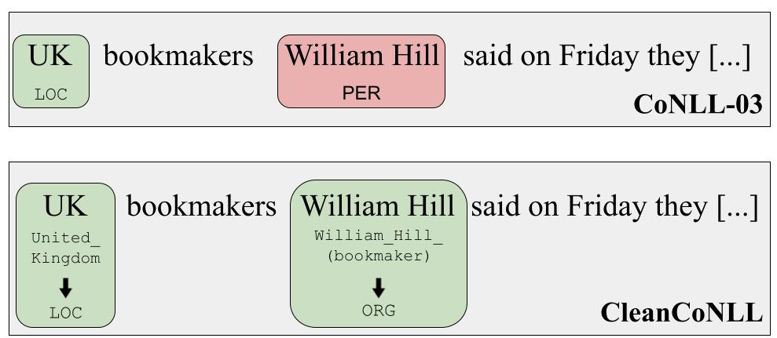

# CleanCoNLL: A Nearly Noise-Free Named Entity Recognition Dataset
We semi-automatically corrected annotation errors in the classic CoNLL-03 dataset for Named Entity Recognition (NER). Get our corpus **CleanCoNLL** -- CoNLL-03 with nearly noise-free NER annotations -- with the help of this repository!

For details of the creation and evaluation of the dataset, have a look at our [EMNLP 2023 paper](https://arxiv.org/pdf/2310.16225.pdf)!




## About CleanCoNLL
Details are in the paper, but in short: We leveraged the Wikipedia links from the [AIDA CoNLL Yago dataset](https://www.mpi-inf.mpg.de/departments/databases-and-information-systems/research/ambiverse-nlu/aida/downloads) for assigning NER labels for each mention in a hybrid (automatically as well as manual) relabeling approach. Furthermore, we performed several rounds of cross-checking for correcting remaining errors and resolving inconsistencies.
Overall, we updated 7\% of labels from the original CoNLL-03.

We keep the original tagging scheme with 4 types (PER, LOC, ORG, MISC). We add the NEL (Named Entity Linking) annotations, i.e. Wikipedia links to our annotations.

Note: As source text base, we used the corrected corpus version by Reiss et al. (2020) ([paper](https://aclanthology.org/2020.conll-1.16/), [repo](https://github.com/CODAIT/Identifying-Incorrect-Labels-In-CoNLL-2003)), as they not only already modified some of the label errors, but also corrected some problems with token, sentence and mention splitting. 

## How to get CleanCoNLL?
We distribute our CleanCoNLL annotations in column format. In the annotation files the tokens are masked (`[TOKEN]`) for licence reasons, but you'll find a simple shell script that allows you to recreate CleanCoNLL with the help of the original CoNLL-03.

Step-by-step guide:
* Clone this repository.
* Inside `/data/cleanconll_annotations` you can find our masked annotation files (`cleanconll_annotations.dev.train`, `cleanconll_annotations.dev`, `cleanconll_annotations.test`).
* Inside `/data/patch_files` you find pach files that represent the updates in the text base between the original CoNLL-03 and CleanCoNLL. This is needed for merging our annotations to the original corpus!
* However, you simply need to run our script
  ```
  chmod u+x create_cleanconll_from_conll03.sh
  bash create_cleanconll_from_conll03.sh
  ```
  which will:
  * download the original CoNLL-03 corpus
  * apply the patch files to the original CoNLL-03 text for alligning the text base before merging our annotations
  * create the three CleanCoNLL files with text and annotations, they will be placed inside `/data/cleanconll`.

  ## Dataset Columns
  The three files will look like this: Column format with the following 5 columns, the last 3 with BIO tagging scheme:
  
  ```
  Token     POS     Wikipedia     NER (CleanCoNLL*)     NER (CleanCoNLL)
  ```
  
  CleanCoNLL* is the CleanCoNLL version before Phase 3, i.e. before reverting the adjectival affiliations back to MISC, see paper for details.
  
  Sentences are separated by an empty line, articles by the `-DOCSTART-` token.

  So, an excerpt of the dataset looks like this:
  ```
  -DOCSTART-	-X-	O	O	O
  
  SOCCER	NN	O	O	O
  -	:	O	O	O
  JAPAN	NNP	B-Japan_national_football_team	B-ORG	B-ORG
  GET	VB	O	O	O
  LUCKY	NNP	O	O	O
  WIN	NNP	O	O	O
  ,	,	O	O	O
  CHINA	NNP	B-China_national_football_team	B-ORG	B-ORG
  IN	IN	O	O	O
  SURPRISE	DT	O	O	O
  DEFEAT	NN	O	O	O
  .	.	O	O	O
  ```


  
